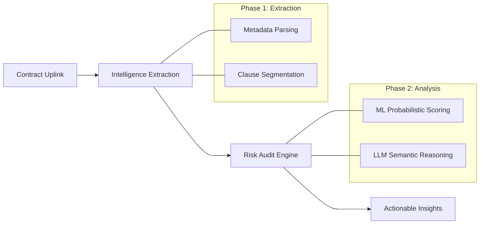

# Pippo AI: Intelligent Legal Partner

**Bharat's Precision. Global Ambition. Intelligent World.**

Pippo AI is a next-generation, agentic intelligence engine designed to navigate the complexities of modern legal landscapes. Engineered for deep-nuance analysis, Pippo AI identifies, classifies, and audits risky clauses in contractual documents with high-fidelity precision using a hybrid ML and LLM Reasoning approach.


---

## Core Intelligence Architecture

Pippo AI is built on a "Deep Audit" philosophy, moving beyond simple keyword matching to understanding the fundamental intent of legal prose.

- **Agentic Reasoning Engine:** Powered by `LangGraph` and `GPT-4o`, the system performs multi-step semantic verification, identifies hidden liabilities, and suggests mitigation strategies.
- **Machine Learning Layer:** A robust `RandomForest` classifier provides a probabilistic baseline for risk, trained on thousands of curated legal clauses.
- **Hybrid Scoring:** Combines data-driven ML models with logic-driven LLM agents to produce a unified "Contract DNA" risk profile.

---

## System Workflow

Pippo AI follows a high-fidelity pipeline to transform raw legal documents into actionable risk intelligence:



---

## Features and Capabilities

### HUD-Inspired Interface
Experience a premium, high-contrast dark theme designed for focus. Featuring glassmorphism, dynamic bento-cards, and real-time scanning feedback.

### Multidimensional Extraction
- **Legal Metadata:** Automatic detection of Parties, Effective Dates, Jurisdiction, and Governing Laws.
- **Smart OCR:** Intelligent fallback for scanned documents and image-heavy PDFs.
- **Clause Segmentation:** Proprietary regex-based splitting that preserves legal context.

### Risk Analytics and Export
- **Bento Dashboard:** Visual representations of risk ratios using `Recharts`.
- **Professional Reports:** Export findings into branded, ready-to-share PDF audits.

---

## Quick Start

### 1. Local Setup
Ensure you have Node.js (18+) and Python 3.9+ installed and run the following in your terminal:

```bash
# Clone the repository
git clone https://github.com/Gautam-Bharadwaj/Pippo.ai.git
cd Pippo.ai

# Install Frontend Dependencies
npm install

# Install Backend Dependencies
pip install -r requirements.txt

# Setup Environment
echo "OPENAI_API_KEY=your_key_here" > .env

# Launch the engine
npm run dev
```

### 2. Deployment
- **Vercel (Recommended):** Connect your GitHub repo and deploy. Vercel automatically detects the Next.js frontend and the FastAPI backend in `/api`.

---

## Built With

- **Frontend:** Next.js 14, React, Framer Motion, Recharts
- **Backend:** FastAPI, Python 3.9, OpenAI, LangChain, LangGraph
- **Data/ML:** Scikit-learn, Pandas, NLTK, PyMuPDF
- **Reporting:** ODFPy, Joblib

---

## The Team & Contributions

| Member | Core Responsibility | Key Contribution |
| :--- | :--- | :--- |
| **Kumar Gautam** | System Architecture | Developed the hybrid Next.js/FastAPI foundation, OCR pipeline, and the HUD-inspired UX design system. |
| **Mohit Kourav** | AI & ML Engineering | Engineered the RandomForest risk classifier and the Multi-Agent Reasoning orchestration using LangGraph. |
| **Karan Thakur** | Data & Reporting | Implemented the Clause Segmentation logic, persistence layers, and the automated professional report generation. |

---

<p align="center">
  
  
</p>

© Pippo AI Intelligence.
